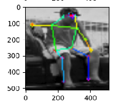
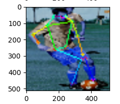

## Human-pose-estimation

This repository contains my own experiments, research, reproductions of state-of-the-art human pose estimation. Please note this is a **WIP** and this repository will be continously updated.

## TODO list

- [x] Vanilla hour-glass networks with stacking, trained from scratch (no transfer learning)
- [x] Step/cyclic learning rates (experimental)
- [ ] Gaussian smoothed labels
- [ ] More data augumentation
- [ ] Gated skip connections
- [ ] Add data preparation steps
- [ ] Optimise for real-time inference speeds

## Dataset

Currently, i have used the COCO person keypoints dataset to train. Since this is a multi-person dataset, there is a preparation step to extract single persons.

@TODO: Add data preparation step for COCO

## Train

An example experiment exists in [experiments/hourglass_stack1.sh](experiments/hourglass_stack1.sh)	

1. Replace the directory configurations inside the script. 

2. To train call

	`./experiments/hourglass_stack1.sh`

## Results

Some initial result copied from tensorboard are shown here. These will be replaced with better samples when I have an updated model

 

## Support

In case you are interested in support or collaboration, send me a message on [LinkedIn](https://www.linkedin.com/in/raktim-bora-66832b17/)